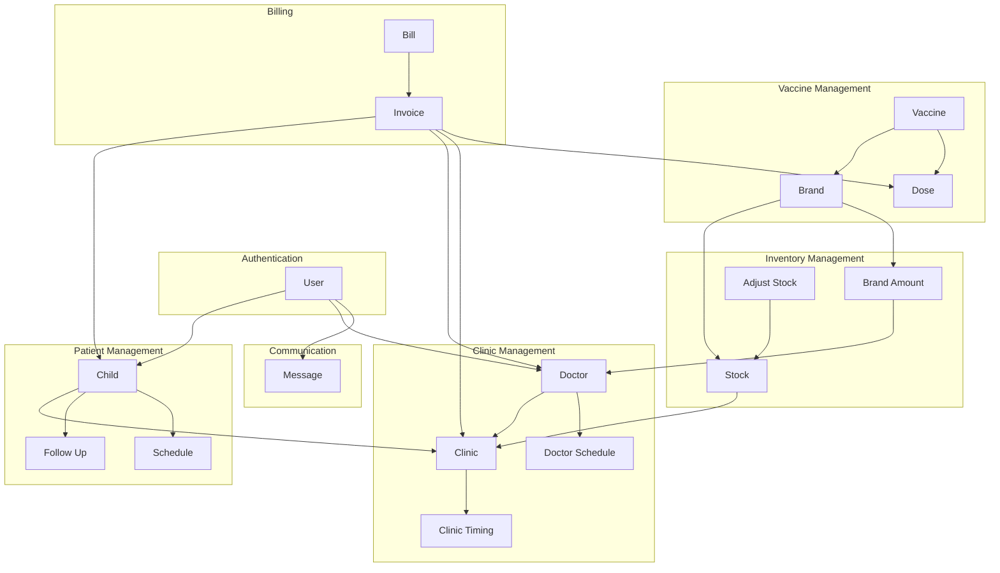

```mermaid
graph TD
    subgraph Authentication
        User[User]
    end
    
    subgraph Patient Management
        Child[Child]
        FollowUp[Follow Up]
        Schedule[Schedule]
    end
    
    subgraph Clinic Management
        Clinic[Clinic]
        Doctor[Doctor]
        ClinicTiming[Clinic Timing]
        DoctorSchedule[Doctor Schedule]
    end
    
    subgraph Vaccine Management
        Vaccine[Vaccine]
        Brand[Brand]
        Dose[Dose]
    end
    
    subgraph Inventory Management
        Stock[Stock]
        BrandAmount[Brand Amount]
        AdjustStock[Adjust Stock]
    end
    
    subgraph Billing
        Invoice[Invoice]
        Bill[Bill]
    end
    
    subgraph Communication
        Message[Message]
    end
    
    %% Relationships
    User --> Child
    User --> Doctor
    User --> Message
    
    Child --> Clinic
    Child --> FollowUp
    Child --> Schedule
    
    Doctor --> Clinic
    Doctor --> DoctorSchedule
    
    Clinic --> ClinicTiming
    
    Vaccine --> Brand
    Vaccine --> Dose
    
    Brand --> Stock
    Brand --> BrandAmount
    
    Stock --> Clinic
    BrandAmount --> Doctor
    
    Invoice --> Child
    Invoice --> Doctor
    Invoice --> Clinic
    Invoice --> Dose
    
    Bill --> Invoice
    
    AdjustStock --> Stock
```